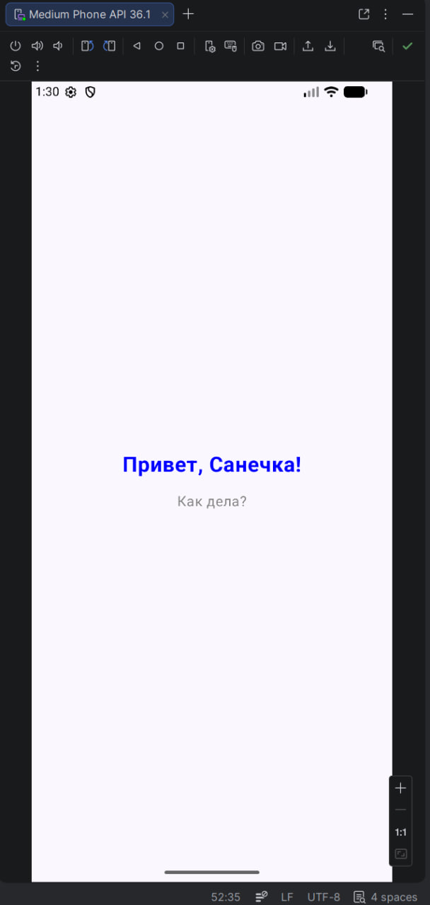
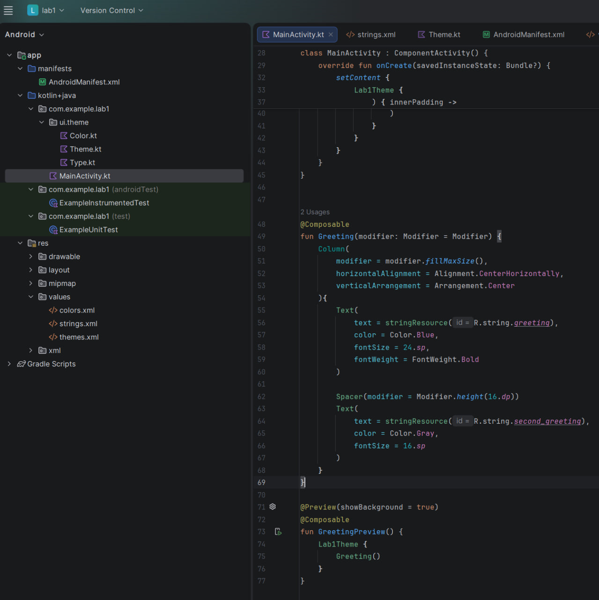

# Лабораторная работа №1

<div align="center">

**МИНИСТЕРСТВО НАУКИ И ВЫСШЕГО ОБРАЗОВАНИЯ РОССИЙСКОЙ ФЕДЕРАЦИИ**  
**ФЕДЕРАЛЬНОЕ ГОСУДАРСТВЕННОЕ БЮДЖЕТНОЕ ОБРАЗОВАТЕЛЬНОЕ УЧРЕЖДЕНИЕ ВЫСШЕГО ОБРАЗОВАНИЯ**  
**«САХАЛИНСКИЙ ГОСУДАРСТВЕННЫЙ УНИВЕРСИТЕТ»**

<br>
<br>

Институт естественных наук и техносферной безопасности  
Кафедра информатики  
**Каменев Александр Павлович**

<br>
<br>
<br>
<br>

Лабораторная работа №1  
**«MyFirstApp»**  
01.03.02 Прикладная математика и информатика  
3 Курс

<br>
<br>
<br>
<br>
<br>
<br>
<br>
<br>
<br>
<br>
<br>
<br>
<br>

<div align="right">
Научный руководитель<br>
Соболев Евгений Игоревич
</div>

<br>
<br>
<br>

г. Южно-Сахалинск  
2026 г.

</div>

---  

## Цель Работы

Изучить структуру Android-проекта в среде разработки Android Studio, освоить процесс создания и модификации пользовательского интерфейса, научиться запускать приложение на эмуляторе, а также закрепить навыки работы с файлами ресурсов.

## Скриншоты
  
<br>


## Листинг
```kt
package com.example.lab1.ui.theme

        import android.app.Activity
        import android.os.Build
        import androidx.compose.foundation.isSystemInDarkTheme
        import androidx.compose.material3.MaterialTheme
        import androidx.compose.material3.darkColorScheme
        import androidx.compose.material3.dynamicDarkColorScheme
        import androidx.compose.material3.dynamicLightColorScheme
        import androidx.compose.material3.lightColorScheme
        import androidx.compose.runtime.Composable
        import androidx.compose.ui.platform.LocalContext

        private val DarkColorScheme = darkColorScheme(
        primary = Purple80,
        secondary = PurpleGrey80,
        tertiary = Pink80
        )

        private val LightColorScheme = lightColorScheme(
        primary = Purple40,
        secondary = PurpleGrey40,
        tertiary = Pink40
        )

        @Composable
        fun Lab1Theme(
        darkTheme: Boolean = isSystemInDarkTheme(),
        dynamicColor: Boolean = true,
        content: @Composable () -> Unit
        ) {
        val colorScheme = when {
        dynamicColor && Build.VERSION.SDK_INT >= Build.VERSION_CODES.S -> {
        val context = LocalContext.current
        if (darkTheme) dynamicDarkColorScheme(context) else dynamicLightColorScheme(context)
        }

        darkTheme -> DarkColorScheme
        else -> LightColorScheme
        }

        MaterialTheme(
        colorScheme = colorScheme,
        typography = Typography,
        content = content
        )
        }
  ```

## Ответы на контрольные вопросы

**1. Какие основные компоненты входят в структуру Android-проекта?**  
В Android Studio проект обычно делится на несколько крупных частей. В **Manifests** лежит `AndroidManifest.xml` — по сути паспорт приложения для системы. В **Java/Kotlin** — сам код: активности, классы, вся логика. Папка **Res** — это ресурсы: картинки, строки, цвета, темы, разметки экранов. И отдельно **Gradle Scripts** — там `build.gradle` и прочее, через это настраивается сборка и подключаются библиотеки.

**2. Для чего нужен файл AndroidManifest.xml?**  
Без манифеста Android вообще не поймёт, что за приложение перед ним. В этом файле прописывают имя, иконку, какие экраны (активности) есть, с чего приложение стартует, и какие разрешения ему нужны — например доступ к камере или интернету.

**3. Чем отличается minSdkVersion от targetSdkVersion?**  
`minSdkVersion` — это «нижняя планка»: на какой версии Android приложение ещё можно поставить и оно хотя бы запустится. А `targetSdkVersion` — версия, под которую мы его в первую очередь делали и тестировали. На телефонах поновее оно тоже может работать, но система смотрит на target и может вести себя по-разному с точки зрения совместимости.

**4. Что такое AVD и для чего он используется?**  
AVD (Android Virtual Device) — это виртуальный телефон/планшет в эмуляторе. Удобно, когда под рукой нет реального устройства: создал AVD в Android Studio и гоняешь на нём своё приложение прямо с компьютера.

**5. Как изменить текст приложения без изменения кода активности?**  
Текст лучше не хардкодить в коде, а вынести в `res/values/strings.xml`. В разметке или в Kotlin тогда пишешь не саму фразу, а ссылку вроде `@string/app_name`. Поменял строку в `strings.xml` — и на экране уже другой текст, саму активность трогать не обязательно.

## Вывод

Несмотря на то, что в методическом пособии представлена структура другого формата, я изучил более современный формат, который по умолчанию предлагает Android Studio и с помощью него реализовал данную лабораторую работу.
