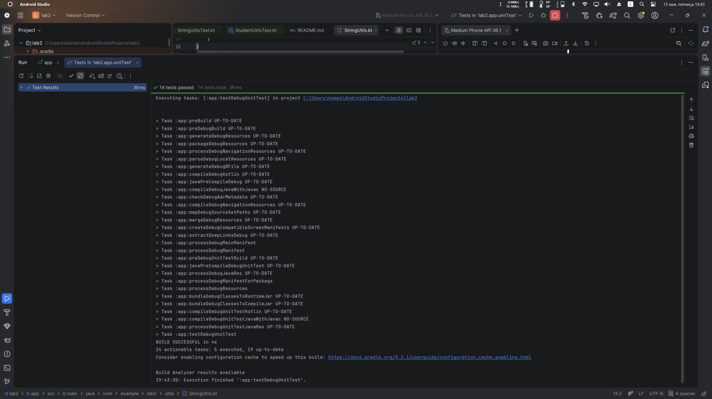
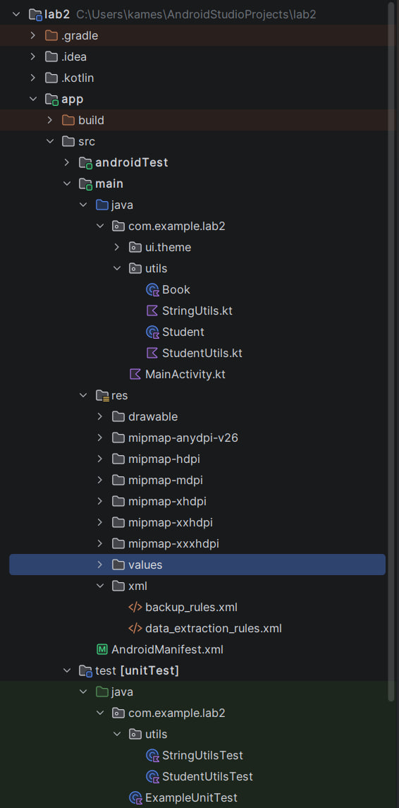

# Лабораторная работа №2

<div align="center">

**МИНИСТЕРСТВО НАУКИ И ВЫСШЕГО ОБРАЗОВАНИЯ РОССИЙСКОЙ ФЕДЕРАЦИИ**  
**ФЕДЕРАЛЬНОЕ ГОСУДАРСТВЕННОЕ БЮДЖЕТНОЕ ОБРАЗОВАТЕЛЬНОЕ УЧРЕЖДЕНИЕ ВЫСШЕГО ОБРАЗОВАНИЯ**  
**«САХАЛИНСКИЙ ГОСУДАРСТВЕННЫЙ УНИВЕРСИТЕТ»**

<br>
<br>

Институт естественных наук и техносферной безопасности  
Кафедра информатики  
**Каменев Александр Павлович**

<br>
<br>
<br>
<br>

Лабораторная работа №2  
**«Написание консольных утилит на Kotlin внутри Android проекта. Расчеты, работа со строками. Подготовка классов данных для будущего приложения»**  
01.03.02 Прикладная математика и информатика  
3 Курс

<br>
<br>
<br>
<br>
<br>
<br>
<br>
<br>
<br>
<br>
<br>
<br>
<br>

<div align="right">
Научный руководитель<br>
Соболев Евгений Игоревич
</div>

<br>
<br>
<br>

г. Южно-Сахалинск  
2026 г.

</div>

---

## Цель Работы

Научиться создавать классы данных и функции-утилиты на Kotlin в контексте Android-проекта, освоить базовые приёмы работы со строками и числами, познакомиться с юнит-тестированием для проверки корректности кода.

## Индивидуальное задание: Класс "Студент"

Реализовано

## Скриншоты



<br>


<br>



## Листинг кода

### 1. Класс данных Book (`Book.kt`)

```kotlin
package com.example.lab2.utils

data class Book(
  val title: String,
  val author: String,
  val year: Int,
  val price: Double
)

```

### 2. Утилиты для работы со строками (`StringUtils.kt`)

```kotlin
package com.example.lab2.utils

fun String.isValidEmail(): Boolean {
  return this.contains("@") && this.contains(".")
}

fun formatAuthorName(fullName: String): String {
  val parts = fullName.split(" ").filter { it.isNotBlank() }
  return when (parts.size) {
    1 -> parts[0]
    2 -> "${parts[0]} ${parts[1].first()}."
    3 -> "${parts[0]} ${parts[1].first()}.${parts[2].first()}."
    else -> fullName
  }
}

fun applyDiscount(price: Double, discountPercent: Double): Double {
  require(discountPercent in 0.0..100.0) { "Скидка должна быть от 0 до 100" }
  return price * (1 - discountPercent / 100)
}

```

### 3. Класс StudentUtils (`StudentUtils.kt`)

```kotlin
package com.example.lab2.utils

fun formatStudentInfo(student: Student): String {
    val initial = "${student.firstName.first()}."
    return "${student.lastName} $initial (группа ${student.group})"
}

fun getStudentStatus(averageGrade: Double): String {
    return when {
        averageGrade >= 4.5 -> "отличник"
        averageGrade >= 3.5 -> "хорошист"
        else -> "троечник"
    }
}

```

### 4. Тесты для StringUtils (`StringUtilsTest.kt`)

```kotlin
package com.example.lab2.utils

import org.junit.Assert.*
import org.junit.Test

class StringUtilsTest {

  @Test
  fun emailValidation_correct() {
    assertTrue("test@example.com".isValidEmail())
    assertTrue("user.name@domain.co".isValidEmail())
  }

  @Test
  fun emailValidation_incorrect() {
    assertFalse("testexample.com".isValidEmail())
    assertFalse("test@example".isValidEmail())
    assertFalse("".isValidEmail())
  }

  @Test
  fun formatAuthorName_fullName() {
    assertEquals("Толстой Л.Н.", formatAuthorName("Толстой Лев Николаевич"))
    assertEquals("Пушкин А.С.", formatAuthorName("Пушкин Александр Сергеевич"))
  }

  @Test
  fun formatAuthorName_twoParts() {
    assertEquals("Толстой Л.", formatAuthorName("Толстой Лев"))
    assertEquals("Пушкин А.", formatAuthorName("Пушкин Александр"))
  }

  @Test
  fun formatAuthorName_onePart() {
    assertEquals("Толстой", formatAuthorName("Толстой"))
  }

  @Test
  fun applyDiscount_normal() {
    assertEquals(90.0, applyDiscount(100.0, 10.0), 0.001)
    assertEquals(75.0, applyDiscount(150.0, 50.0), 0.001)
  }

  @Test
  fun applyDiscount_zero() {
    assertEquals(100.0, applyDiscount(100.0, 0.0), 0.001)
  }

  @Test(expected = IllegalArgumentException::class)
  fun applyDiscount_invalidLow() {
    applyDiscount(100.0, -5.0)
  }

  @Test(expected = IllegalArgumentException::class)
  fun applyDiscount_invalidHigh() {
    applyDiscount(100.0, 110.0)
  }
}

```

### 5. Тесты для CurrencyConverter (`StudentUtilsTest.kt`)

```kotlin
package com.example.lab2.utils

import org.junit.Assert.*
import org.junit.Test

class StudentUtilsTest {

  private val student = Student("Иван", "Иванов", "ПИ-101", 4.8)

  @Test
  fun formatStudentInfo_normal() {
    assertEquals("Иванов И. (группа ПИ-101)", formatStudentInfo(student))
    assertEquals(
      "Петрова А. (группа ИС-202)",
      formatStudentInfo(Student("Анна", "Петрова", "ИС-202", 3.9))
    )
  }

  @Test
  fun getStudentStatus_otlichnik() {
    assertEquals("отличник", getStudentStatus(5.0))
    assertEquals("отличник", getStudentStatus(4.5))
  }

  @Test
  fun getStudentStatus_horoshist() {
    assertEquals("хорошист", getStudentStatus(4.4))
    assertEquals("хорошист", getStudentStatus(3.5))
  }

  @Test
  fun getStudentStatus_troechnik() {
    assertEquals("троечник", getStudentStatus(3.4))
    assertEquals("троечник", getStudentStatus(2.0))
  }
}

```
### 6. MainActivity.kt

```kotlin
package com.example.lab2

import android.os.Bundle
import androidx.activity.ComponentActivity
import androidx.activity.compose.setContent
import androidx.activity.enableEdgeToEdge
import androidx.compose.foundation.layout.Column
import androidx.compose.foundation.layout.fillMaxSize
import androidx.compose.foundation.layout.padding
import androidx.compose.material3.Scaffold
import androidx.compose.material3.Text
import androidx.compose.runtime.Composable
import androidx.compose.ui.Modifier
import androidx.compose.ui.tooling.preview.Preview
import androidx.compose.ui.unit.dp
import com.example.lab2.ui.theme.Lab2Theme
import com.example.lab2.utils.Book
import com.example.lab2.utils.Student
import com.example.lab2.utils.applyDiscount
import com.example.lab2.utils.formatAuthorName
import com.example.lab2.utils.formatStudentInfo
import com.example.lab2.utils.getStudentStatus

class MainActivity : ComponentActivity() {
  override fun onCreate(savedInstanceState: Bundle?) {
    super.onCreate(savedInstanceState)
    enableEdgeToEdge()
    setContent {
      Lab2Theme {
        Scaffold(modifier = Modifier.fillMaxSize()) { innerPadding ->
          BookInfo(modifier = Modifier.padding(innerPadding))
        }
      }
    }
  }
}

@Composable
fun BookInfo(modifier: Modifier = Modifier) {
  val book = Book("Война и мир", "Толстой Лев Николаевич", 1869, 500.0)
  val formattedAuthor = formatAuthorName(book.author)
  val discountedPrice = applyDiscount(book.price, 15.0)

  val student = Student("Иван", "Иванов", "ПИ-101", 4.8)

  Column(modifier = modifier.padding(16.dp)) {
    Text(text = "Книга: ${book.title}")
    Text(text = "Автор: $formattedAuthor")
    Text(text = "Цена со скидкой: $discountedPrice руб.")
    Text(text = formatStudentInfo(student))
    Text(text = "Статус: ${getStudentStatus(student.averageGrade)}")
  }
}

@Preview(showBackground = true)
@Composable
fun BookInfoPreview() {
  Lab2Theme {
    BookInfo()
  }
}

```

## Ответы на контрольные вопросы

**1. Для чего в Kotlin используются data class?**  
Хранить данные; компилятор сам генерирует equals, hashCode, toString, copy.

**2. Чем отличается функция расширения от обычной функции?**  
Функция расширения — как обычная функция, но вызывается на объекте ("a@b.c".isValidEmail()), пишется с префиксом

**3. Как запустить юнит-тесты в Android Studio?**  
Запуск тестов — ПКМ на тесте/папке test → Run, или Gradle task testDebugUnitTest.

**4. Что такое assertEquals и для чего нужен третий параметр (дельта) при сравнении вещественных чисел?**  
assertEquals с delta — сравнивает Double с допустимой погрешностью (из‑за ошибок округления).

**5. В какой директории проекта хранятся тесты, выполняющиеся на JVM?**  
Тесты на JVM — в app/src/test/java. хранятся в директории `app/src/test/java/`.

## Вывод

В ходе лабораторной работы я сделал набор утилит для работы со строками и числами в Android-проекте на Kotlin.

В процессе работы я разобрался с тем, что было в задании:

data class — создал классы Book и Student для хранения данных;
функции расширения — сделал проверку email через isValidEmail() для строки;
работа со строками — написал функцию, которая сокращает ФИО автора (например, «Толстой Л.Н.»), и функцию для студента в формате «Иванов И. (группа ПИ-101)»;
расчёты — скидка на книгу и определение статуса студента по среднему баллу;
проверка данных — использовал require, чтобы скидка была от 0 до 100.
Также я написал юнит-тесты в StringUtilsTest и StudentUtilsTest. Проверил обычные случаи, граничные значения и ошибки. Все тесты прошли успешно (зелёная полоса), значит функции работают правильно.

Для индивидуального задания я выбрал вариант «Студент»: класс Student, форматирование строки и функция статуса (отличник, хорошист, троечник). На это тоже написал тесты.

В приложении на экране вывел информацию о книге со скидкой и данные студента. Запустил на эмуляторе — всё отображается нормально.

Вывод: цель работы выполнена. Я научился создавать data class, писать утилиты на Kotlin и проверять их через юнит-тесты в Android-проекте.
