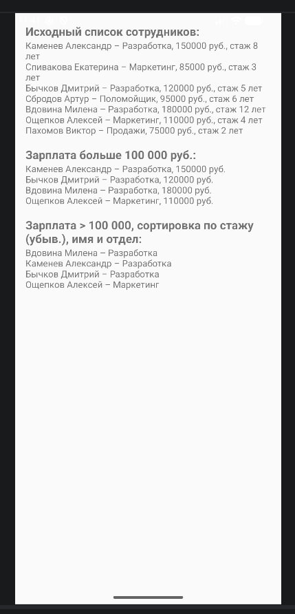
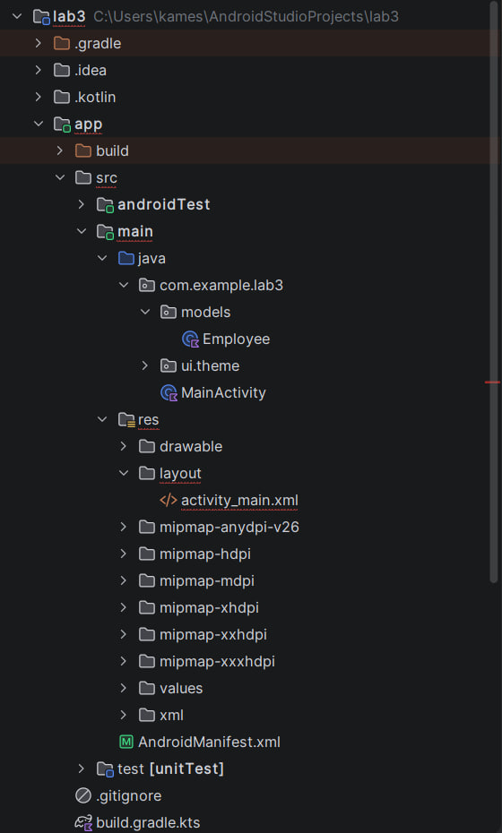
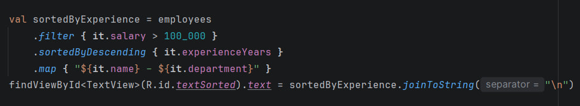

# Лабораторная работа №3

<div align="center">

**МИНИСТЕРСТВО НАУКИ И ВЫСШЕГО ОБРАЗОВАНИЯ РОССИЙСКОЙ ФЕДЕРАЦИИ**  
**ФЕДЕРАЛЬНОЕ ГОСУДАРСТВЕННОЕ БЮДЖЕТНОЕ ОБРАЗОВАТЕЛЬНОЕ УЧРЕЖДЕНИЕ ВЫСШЕГО ОБРАЗОВАНИЯ**  
**«САХАЛИНСКИЙ ГОСУДАРСТВЕННЫЙ УНИВЕРСИТЕТ»**

<br>
<br>

Институт естественных наук и техносферной безопасности  
Кафедра информатики  
**Каменев Александр Павлович**

<br>
<br>
<br>
<br>

Лабораторная работа №3  
**«Реализация списка объектов с фильтрацией с использованием .map, .filter, .sortedBy»**  
01.03.02 Прикладная математика и информатика  
3 курс

<br>
<br>
<br>
<br>
<br>
<br>
<br>
<br>
<br>
<br>
<br>
<br>
<br>

<div align="right">
Научный руководитель<br>
Соболев Евгений Игоревич
</div>

<br>
<br>
<br>

г. Южно-Сахалинск  
2026 г.

</div>

---

## Цель работы

Освоить функциональную обработку коллекций в Kotlin (`filter`, `map`, `sortedBy`, `sortedByDescending`) на примере списка объектов и отобразить результаты в Android-приложении.

## Индивидуальное задание: список сотрудников

Выполнен вариант **№2 — «Список сотрудников»**.

Требования:

- создать список сотрудников (имя, отдел, зарплата, стаж);
- показать сотрудников с зарплатой больше 100 000 руб.;
- отсортировать отобранных по стажу по убыванию;
- вывести имена и отделы.

Проект: **lab3**, пакет `com.example.lab3`.

## Скриншоты
    

  
*Рисунок 1 — Экран приложения: исходный список, фильтрация и сортировка*

<br>

  
*Рисунок 2 — Структура проекта, пакет `models` с классом `Employee`*

<br>

  
*Рисунок 3 — Цепочка `filter` → `sortedByDescending` → `map` в `MainActivity`*

## Листинги

### 1. Класс данных `Employee` (`Employee.kt`)

```kotlin
package com.example.lab3.models

data class Employee(
    val name: String,
    val department: String,
    val salary: Double,
    val experienceYears: Int
)
```

### 2. Разметка `activity_main.xml`

```xml
<?xml version="1.0" encoding="utf-8"?>
<ScrollView
    xmlns:android="http://schemas.android.com/apk/res/android"
    android:layout_width="match_parent"
    android:layout_height="match_parent">

    <LinearLayout
        android:layout_width="match_parent"
        android:layout_height="wrap_content"
        android:orientation="vertical"
        android:padding="16dp">

        <TextView
            android:layout_width="wrap_content"
            android:layout_height="wrap_content"
            android:text="Исходный список сотрудников:"
            android:textStyle="bold"
            android:textSize="18sp"/>

        <TextView
            android:id="@+id/textOriginal"
            android:layout_width="match_parent"
            android:layout_height="wrap_content"
            android:layout_marginBottom="16dp"/>

        <TextView
            android:layout_width="wrap_content"
            android:layout_height="wrap_content"
            android:text="Зарплата больше 100 000 руб.:"
            android:textStyle="bold"
            android:textSize="18sp"/>

        <TextView
            android:id="@+id/textHighSalary"
            android:layout_width="match_parent"
            android:layout_height="wrap_content"
            android:layout_marginBottom="16dp"/>

        <TextView
            android:layout_width="wrap_content"
            android:layout_height="wrap_content"
            android:text="Зарплата &gt; 100 000, сортировка по стажу (убыв.), имя и отдел:"
            android:textStyle="bold"
            android:textSize="18sp"/>

        <TextView
            android:id="@+id/textSorted"
            android:layout_width="match_parent"
            android:layout_height="wrap_content"/>

    </LinearLayout>
</ScrollView>
```

### 3. `MainActivity.kt`

```kotlin
package com.example.lab3

import android.os.Bundle
import android.widget.TextView
import androidx.activity.ComponentActivity
import com.example.lab3.models.Employee

class MainActivity : ComponentActivity() {
    override fun onCreate(savedInstanceState: Bundle?) {
        super.onCreate(savedInstanceState)
        setContentView(R.layout.activity_main)

        val employees = getEmployees()

        val originalText = employees.joinToString("\n") {
            "${it.name} – ${it.department}, ${it.salary.toInt()} руб., стаж ${it.experienceYears} лет"
        }
        findViewById<TextView>(R.id.textOriginal).text = originalText

        val highSalaryEmployees = employees.filter { it.salary > 100_000 }
        val highSalaryText = highSalaryEmployees.joinToString("\n") {
            "${it.name} – ${it.department}, ${it.salary.toInt()} руб."
        }
        findViewById<TextView>(R.id.textHighSalary).text = highSalaryText

        val sortedByExperience = employees
            .filter { it.salary > 100_000 }
            .sortedByDescending { it.experienceYears }
            .map { "${it.name} – ${it.department}" }
        findViewById<TextView>(R.id.textSorted).text = sortedByExperience.joinToString("\n")
    }

    private fun getEmployees(): List<Employee> {
        return listOf(
            Employee("Каменев Александр", "Разработка", 150_000.0, 8),
            Employee("Спивакова Екатерина", "Маркетинг", 85_000.0, 3),
            Employee("Бычков Дмитрий", "Разработка", 120_000.0, 5),
            Employee("Сбродов Артур", "Поломойщик", 95_000.0, 6),
            Employee("Вдовина Милена", "Разработка", 180_000.0, 12),
            Employee("Ощепков Алексей", "Маркетинг", 110_000.0, 4),
            Employee("Пахомов Виктор", "Продажи", 75_000.0, 2)
        )
    }
}
```

## Ответы на контрольные вопросы

**1. Что возвращает `filter` — новый список или изменяет существующий?**

Возвращает новый список. Старый не меняется — у меня `employees` как был полным, так и остался после фильтра.

**2. В чём разница между `sortedBy` и `sortedByDescending`?**

`sortedBy` — по возрастанию (2, 4, 12 лет стажа), `sortedByDescending` — наоборот, от большего к меньшему. Я для стажа брал второй вариант.

**3. Как можно объединить несколько условий в `filter`?**

Через `&&` и `||` внутри фигурных скобок, например: `filter { it.salary > 100_000 && it.department == "Разработка" }`.

**4. Для чего используется `map`? Приведите пример.**

Чтобы из списка объектов сделать что-то другое — у меня из сотрудников строки: `.map { "${it.name} – ${it.department}" }`, потом их в TextView выводил.

**5. Что такое `joinToString` и как она работает?**

Склеивает список в одну строку. Я писал `joinToString("\n")`, чтобы каждый сотрудник был с новой строки на экране.

## Вывод

Сделал приложение со списком сотрудников и вывел три блока на экран: весь список, только с зарплатой выше 100 000 и отсортированные по стажу с именем и отделом.

Потренировался с `filter`, `map`, `sortedByDescending` и цепочками — когда пишешь подряд, удобнее, чем вручную перебирать список. Приложение на эмуляторе запускается, данные отображаются правильно. В целом цель работы понятна и выполнена.