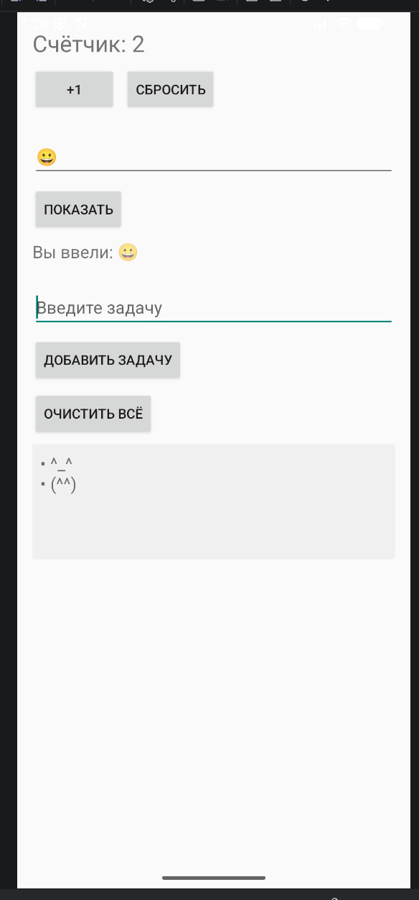
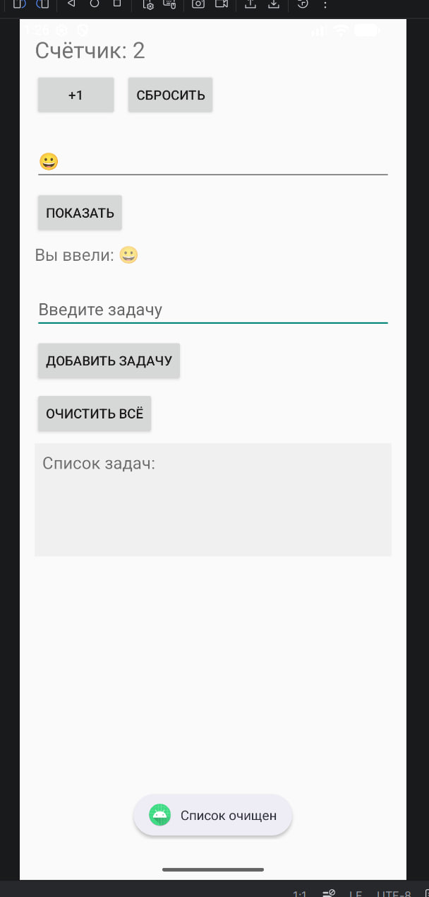
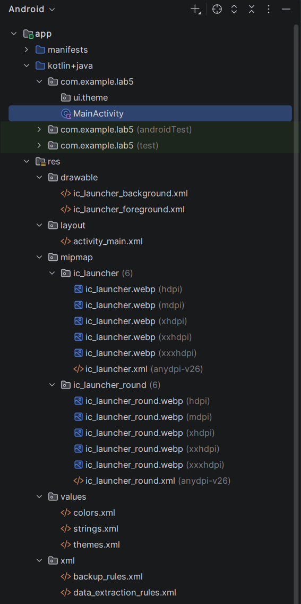

# Лабораторная работа №4

<div align="center">

**МИНИСТЕРСТВО НАУКИ И ВЫСШЕГО ОБРАЗОВАНИЯ РОССИЙСКОЙ ФЕДЕРАЦИИ**  
**ФЕДЕРАЛЬНОЕ ГОСУДАРСТВЕННОЕ БЮДЖЕТНОЕ ОБРАЗОВАТЕЛЬНОЕ УЧРЕЖДЕНИЕ ВЫСШЕГО ОБРАЗОВАНИЯ**  
**«САХАЛИНСКИЙ ГОСУДАРСТВЕННЫЙ УНИВЕРСИТЕТ»**

<br>
<br>

Институт естественных наук и техносферной безопасности  
Кафедра информатики  
**Каменев Александр Павлович**

<br>
<br>
<br>
<br>

Лабораторная работа №4  
**«Верстка экрана профиля пользователя (аватар, имя, кнопка „Редактировать“)»**  
01.03.02 Прикладная математика и информатика  
3 курс

<br>
<br>
<br>
<br>
<br>
<br>
<br>
<br>
<br>
<br>
<br>
<br>
<br>

<div align="right">
Научный руководитель<br>
Соболев Евгений Игоревич
</div>

<br>
<br>
<br>

г. Южно-Сахалинск  
2026 г.

</div>

---

## Цель работы

Освоить вёрстку экрана в Android на `ConstraintLayout`, работу с `ImageView`, `TextView`, `Button`, ресурсами (`strings`, `colors`, `dimens`) и обработку нажатий кнопки.

## Индивидуальное задание №2 — редактирование по нажатию

По нажатию **«Редактировать»** имя и статус заменяются на `EditText`, кнопка меняется на **«Сохранить»**. После сохранения текст обновляется на экране, поля ввода скрываются, показывается Toast.

Проект: **lab4**, пакет `com.example.lab4`.

## Скриншоты

  
*Рисунок 1 — Профиль в режиме просмотра*

<br>

  
*Рисунок 2 — Очищенный текстбокс*

<br>

  
*Рисунок 3 — Структура проекта и ресурсы*

## Листинги

### 1. `activity_main.xml`

```xml
<?xml version="1.0" encoding="utf-8"?>
<androidx.constraintlayout.widget.ConstraintLayout
    xmlns:android="http://schemas.android.com/apk/res/android"
    xmlns:app="http://schemas.android.com/apk/res-auto"
    xmlns:tools="http://schemas.android.com/tools"
    android:layout_width="match_parent"
    android:layout_height="match_parent"
    android:background="@color/gray_light"
    tools:context=".MainActivity">

    <ImageView
        android:id="@+id/imageAvatar"
        android:layout_width="@dimen/avatar_size"
        android:layout_height="@dimen/avatar_size"
        android:layout_marginTop="@dimen/margin_normal"
        android:contentDescription="@string/profile_name"
        android:elevation="4dp"
        android:src="@drawable/logo"
        app:layout_constraintBottom_toTopOf="@+id/textName"
        app:layout_constraintEnd_toEndOf="parent"
        app:layout_constraintStart_toStartOf="parent"
        app:layout_constraintTop_toTopOf="parent" />

    <TextView
        android:id="@+id/textName"
        android:layout_width="wrap_content"
        android:layout_height="wrap_content"
        android:layout_marginTop="@dimen/margin_small"
        android:text="@string/profile_name"
        android:textColor="@color/black"
        android:textSize="@dimen/text_size_name"
        android:textStyle="bold"
        app:layout_constraintEnd_toEndOf="parent"
        app:layout_constraintStart_toStartOf="parent"
        app:layout_constraintTop_toBottomOf="@id/imageAvatar" />

    <EditText
        android:id="@+id/editName"
        android:layout_width="@dimen/edit_min_width"
        android:layout_height="wrap_content"
        android:visibility="gone"
        app:layout_constraintEnd_toEndOf="parent"
        app:layout_constraintStart_toStartOf="parent"
        app:layout_constraintTop_toBottomOf="@id/imageAvatar" />

    <TextView
        android:id="@+id/textStatus"
        android:layout_width="wrap_content"
        android:layout_height="wrap_content"
        android:layout_marginTop="@dimen/margin_small"
        android:text="@string/profile_status"
        android:textColor="@color/purple_500"
        android:textSize="@dimen/text_size_status"
        app:layout_constraintEnd_toEndOf="parent"
        app:layout_constraintStart_toStartOf="parent"
        app:layout_constraintTop_toBottomOf="@id/textName" />

    <EditText
        android:id="@+id/editStatus"
        android:layout_width="@dimen/edit_min_width"
        android:layout_height="wrap_content"
        android:visibility="gone"
        app:layout_constraintEnd_toEndOf="parent"
        app:layout_constraintStart_toStartOf="parent"
        app:layout_constraintTop_toBottomOf="@id/editName" />

    <Button
        android:id="@+id/buttonEdit"
        android:layout_width="wrap_content"
        android:layout_height="wrap_content"
        android:layout_marginTop="@dimen/margin_normal"
        android:backgroundTint="@color/purple_200"
        android:text="@string/button_edit"
        app:cornerRadius="@dimen/button_corner_radius"
        app:layout_constraintEnd_toEndOf="parent"
        app:layout_constraintStart_toStartOf="parent"
        app:layout_constraintTop_toBottomOf="@id/textStatus" />

</androidx.constraintlayout.widget.ConstraintLayout>
```

### 2. `MainActivity.kt`

```kotlin
package com.example.lab4

import android.os.Bundle
import android.view.View
import android.widget.Button
import android.widget.EditText
import android.widget.TextView
import android.widget.Toast
import androidx.appcompat.app.AppCompatActivity

class MainActivity : AppCompatActivity() {

    private var isEditing = false

    override fun onCreate(savedInstanceState: Bundle?) {
        super.onCreate(savedInstanceState)
        setContentView(R.layout.activity_main)

        val textName = findViewById<TextView>(R.id.textName)
        val textStatus = findViewById<TextView>(R.id.textStatus)
        val editName = findViewById<EditText>(R.id.editName)
        val editStatus = findViewById<EditText>(R.id.editStatus)
        val buttonEdit = findViewById<Button>(R.id.buttonEdit)

        buttonEdit.setOnClickListener {
            if (!isEditing) {
                editName.setText(textName.text)
                editStatus.setText(textStatus.text)
                textName.visibility = View.GONE
                textStatus.visibility = View.GONE
                editName.visibility = View.VISIBLE
                editStatus.visibility = View.VISIBLE
                buttonEdit.setText(R.string.button_save)
                isEditing = true
            } else {
                textName.text = editName.text.toString().trim()
                textStatus.text = editStatus.text.toString().trim()
                editName.visibility = View.GONE
                editStatus.visibility = View.GONE
                textName.visibility = View.VISIBLE
                textStatus.visibility = View.VISIBLE
                buttonEdit.setText(R.string.button_edit)
                Toast.makeText(this, R.string.toast_saved, Toast.LENGTH_SHORT).show()
                isEditing = false
            }
        }
    }
}
```

### 3. Ресурсы (`strings.xml`, фрагмент)

```xml
<string name="profile_name">Каменев Александр</string>
<string name="profile_status">Прикладная математика и информатика</string>
<string name="button_edit">Редактировать</string>
<string name="button_save">Сохранить</string>
<string name="toast_saved">Профиль сохранён</string>
```

## Ответы на контрольные вопросы

**1. Для чего используется ConstraintLayout? Какие преимущества перед LinearLayout?**

Нужен, чтобы привязывать элементы друг к другу и к краям экрана. Удобнее, когда много виджетов на одном экране — не получается длинная вложенность, как у нескольких LinearLayout подряд.

**2. Что такое атрибуты `app:layout_constraint...`?**

Это ограничения (constraints): к чему привязан край виджета — к родителю или к другому элементу. Без них в ConstraintLayout элемент может «уехать» или не показаться.

**3. Как вынести размеры и цвета в ресурсы? Зачем это нужно?**

Пишут в `colors.xml`, `dimens.xml`, `strings.xml` и подключают через `@color/...`, `@dimen/...`, `@string/...`. Так проще менять дизайн в одном месте и не дублировать значения в разметке.

**4. Как обработать клик на кнопке в Kotlin?**

Через `setOnClickListener { ... }` — внутри лямбды код, который выполнится при нажатии. У меня там переключение режима редактирования и сохранение.

**5. Как добавить обработчик нажатия на ImageView?**

Так же: `imageAvatar.setOnClickListener { ... }`. ImageView по умолчанию кликабельный, если не отключить `clickable`.

## Вывод

Сверстал экран профиля с аватаром, именем, статусом и кнопкой. Вынес строки, цвета и размеры в ресурсы. Для ИЗ №2 сделал переключение TextView ↔ EditText и смену текста кнопки на «Сохранить». После сохранения данные на экране обновляются, появляется Toast. Приложение запускается на эмуляторе, цель работы выполнена.
