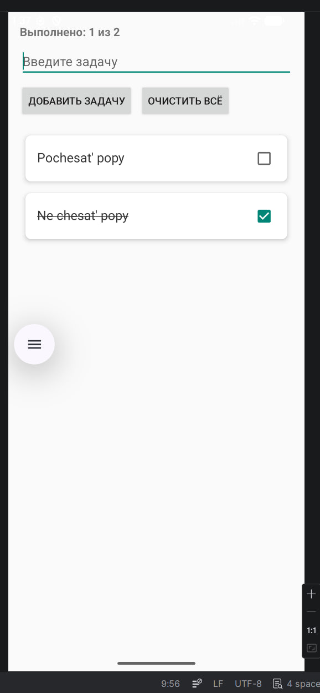
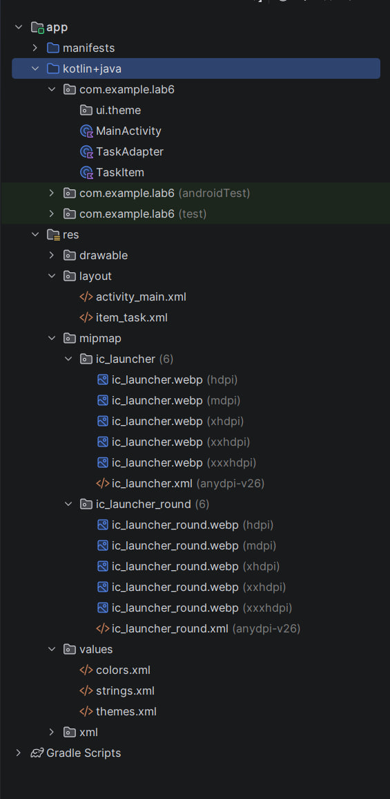

# Лабораторная работа №6

<div align="center">

**МИНИСТЕРСТВО НАУКИ И ВЫСШЕГО ОБРАЗОВАНИЯ РОССИЙСКОЙ ФЕДЕРАЦИИ**  
**ФЕДЕРАЛЬНОЕ ГОСУДАРСТВЕННОЕ БЮДЖЕТНОЕ ОБРАЗОВАТЕЛЬНОЕ УЧРЕЖДЕНИЕ ВЫСШЕГО ОБРАЗОВАНИЯ**  
**«САХАЛИНСКИЙ ГОСУДАРСТВЕННЫЙ УНИВЕРСИТЕТ»**

<br>
<br>

Институт естественных наук и техносферной безопасности  
Кафедра информатики  
**Каменев Александр Павлович**

<br>
<br>
<br>
<br>

Лабораторная работа №6  
**«Отображение списка задач из предыдущей лабораторной в красивых карточках»**  
01.03.02 Прикладная математика и информатика  
3 курс

<br>
<br>
<br>
<br>
<br>
<br>
<br>
<br>
<br>
<br>
<br>
<br>
<br>

<div align="right">
Научный руководитель<br>
Соболев Евгений Игоревич
</div>

<br>
<br>
<br>

г. Южно-Сахалинск  
2026 г.

</div>

---

## Цель работы

Научиться использовать `RecyclerView`, создавать адаптер и `ViewHolder`, оформлять элементы списка через `CardView`.

## Индивидуальное задание №3 — счётчик выполненных задач

В шапке экрана добавлен `TextView` **«Выполнено: X из Y»**. Счётчик обновляется при отметке чекбокса на карточке.

Дополнительно: удаление задачи **долгим нажатием** на карточку, кнопка **«Очистить всё»** (из lab5), состояние чекбоксов хранится в `TaskItem`, чтобы при прокрутке не сбивалось.

Проект: **lab6**, пакет `com.example.lab6`.

## Скриншоты

  
*Рисунок 1 — Задачи в CardView с чекбоксами*

<br>

  
*Рисунок 2 — Структура проекта*

<br>

## Листинги

### 1. `item_task.xml`

```xml
<androidx.cardview.widget.CardView
    android:layout_width="match_parent"
    android:layout_height="wrap_content"
    android:layout_margin="8dp"
    app:cardCornerRadius="8dp"
    app:cardElevation="4dp">

    <LinearLayout ...>
        <TextView android:id="@+id/textTask" ... />
        <CheckBox android:id="@+id/checkTask" ... />
    </LinearLayout>
</androidx.cardview.widget.CardView>
```

Полный файл: `app/src/main/res/layout/item_task.xml`.

### 2. `TaskAdapter.kt`

```kotlin
class TaskAdapter(
    private val tasks: MutableList<TaskItem>,
    private val onCheckedChanged: () -> Unit,
    private val onItemLongClick: (Int) -> Unit
) : RecyclerView.Adapter<TaskAdapter.TaskViewHolder>() {

    class TaskViewHolder(itemView: View) : RecyclerView.ViewHolder(itemView) {
        val textTask: TextView = itemView.findViewById(R.id.textTask)
        val checkTask: CheckBox = itemView.findViewById(R.id.checkTask)
    }

    override fun onBindViewHolder(holder: TaskViewHolder, position: Int) {
        val task = tasks[position]
        holder.textTask.text = task.text
        holder.checkTask.setOnCheckedChangeListener(null)
        holder.checkTask.isChecked = task.isDone
        // перечёркивание + обновление счётчика
        holder.itemView.setOnLongClickListener {
            onItemLongClick(holder.bindingAdapterPosition)
            true
        }
    }
}
```

### 3. `MainActivity.kt` (фрагмент)

```kotlin
recyclerView.layoutManager = LinearLayoutManager(this)
adapter = TaskAdapter(tasks, onCheckedChanged = { updateCompletedCount() }, ...)
recyclerView.adapter = adapter

buttonAddTask.setOnClickListener {
    tasks.add(TaskItem(text))
    adapter.notifyItemInserted(tasks.lastIndex)
    updateCompletedCount()
}

private fun updateCompletedCount() {
    val done = tasks.count { it.isDone }
    textCompletedCount.text = getString(R.string.completed_count, done, tasks.size)
}
```

## Ответы на контрольные вопросы

**1. Для чего нужен RecyclerView? Чем он лучше ListView?**

Показывает длинные списки и переиспользует ячейки при прокрутке — меньше нагрузка на память, чем у старого ListView.

**2. Какие компоненты нужны для RecyclerView?**

`LayoutManager`, `Adapter` и разметка элемента (`item_task.xml`). Без них список не заработает.

**3. Что такое ViewHolder?**

Класс, который хранит ссылки на `TextView`, `CheckBox` и т.д. в карточке, чтобы не вызывать `findViewById` каждый раз при прокрутке.

**4. Чем отличается `notifyDataSetChanged()` от `notifyItemInserted()`?**

Первый перерисовывает весь список, второй — только новую позицию. Второй обычно быстрее и с анимацией.

**5. Как добавить обработку кликов на элементы?**

В `onBindViewHolder`: `holder.itemView.setOnLongClickListener { ... }` или клик на кнопку внутри карточки.

## Вывод

Перенёс ToDo из lab5 на `RecyclerView` с карточками `CardView`. Сделал адаптер с `ViewHolder`, чекбокс с перечёркиванием и счётчик выполненных (ИЗ №3). Долгое нажатие удаляет задачу. Список обновляю через `notifyItemInserted` / `notifyItemRemoved`. Приложение собирается и работает на эмуляторе.
