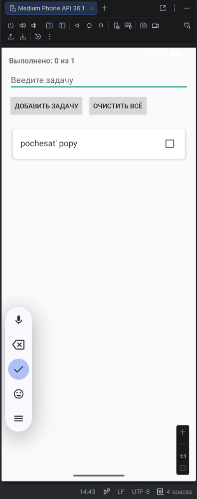
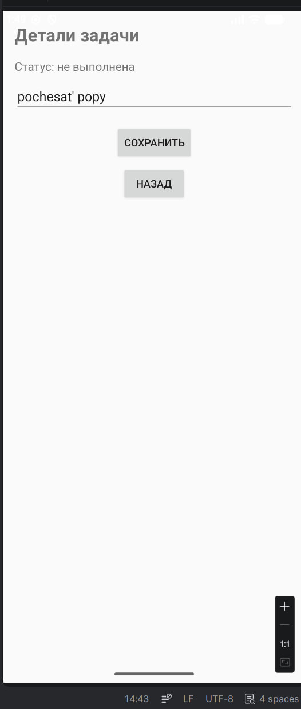
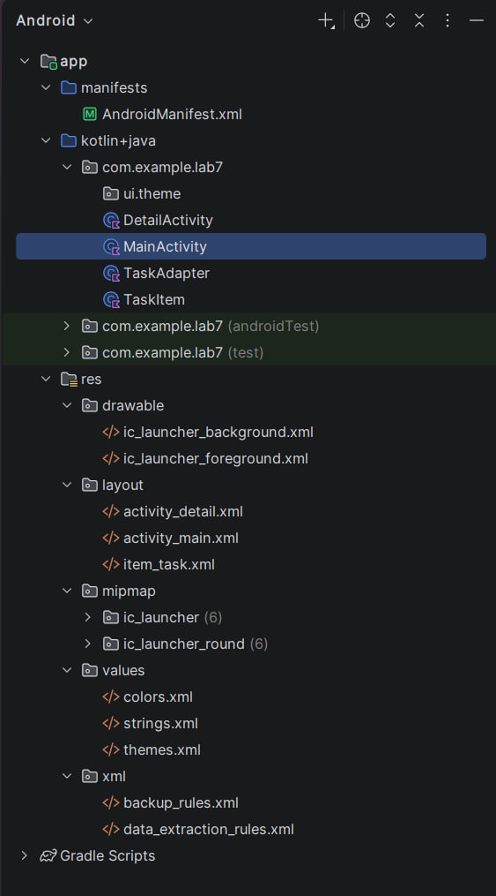

# Лабораторная работа №7

<div align="center">

**МИНИСТЕРСТВО НАУКИ И ВЫСШЕГО ОБРАЗОВАНИЯ РОССИЙСКОЙ ФЕДЕРАЦИИ**  
**ФЕДЕРАЛЬНОЕ ГОСУДАРСТВЕННОЕ БЮДЖЕТНОЕ ОБРАЗОВАТЕЛЬНОЕ УЧРЕЖДЕНИЕ ВЫСШЕГО ОБРАЗОВАНИЯ**  
**«САХАЛИНСКИЙ ГОСУДАРСТВЕННЫЙ УНИВЕРСИТЕТ»**

<br>
<br>

Институт естественных наук и техносферной безопасности  
Кафедра информатики  
**Каменев Александр Павлович**

<br>
<br>
<br>
<br>

Лабораторная работа №7  
**«Добавление второго экрана (детали задачи). Переход по клику на элемент списка»**  
01.03.02 Прикладная математика и информатика  
3 курс

<br>
<br>
<br>
<br>
<br>
<br>
<br>
<br>
<br>
<br>
<br>
<br>
<br>

<div align="right">
Научный руководитель<br>
Соболев Евгений Игоревич
</div>

<br>
<br>
<br>

г. Южно-Сахалинск  
2026 г.

</div>

---

## Цель работы

Создать многоэкранное приложение: переход на второй экран через `Intent`, передача данных, обработка клика по элементу `RecyclerView`.

## Индивидуальное задание №2 — редактирование задачи

На экране деталей — `EditText` с текстом задачи и кнопка **«Сохранить»**. После сохранения текст обновляется в списке на главном экране (через `ActivityResultLauncher`).

Базовая часть: клик по карточке → `DetailActivity`, кнопка **«Назад»** (`finish()`).

Проект: **lab7**, пакет `com.example.lab7`.

## Скриншоты

  
*Рисунок 1 — Список задач в RecyclerView*

<br>

  
*Рисунок 2 — Редактирование задачи на втором экране*

<br>

  
*Рисунок 3 — Структура проекта*

## Листинги

### 1. `activity_detail.xml`

```xml
<LinearLayout ...>
    <TextView android:text="@string/detail_title" ... />
    <TextView android:id="@+id/textTaskStatus" ... />
    <EditText android:id="@+id/editTaskDetail" ... />
    <Button android:id="@+id/buttonSave" android:text="@string/button_save" />
    <Button android:id="@+id/buttonBack" android:text="@string/button_back" />
</LinearLayout>
```

### 2. `DetailActivity.kt`

```kotlin
editTaskDetail.setText(intent.getStringExtra(EXTRA_TASK_TEXT))

buttonSave.setOnClickListener {
    val resultIntent = Intent().apply {
        putExtra(EXTRA_TASK_POSITION, intent.getIntExtra(EXTRA_TASK_POSITION, -1))
        putExtra(EXTRA_NEW_TEXT, editTaskDetail.text.toString().trim())
    }
    setResult(RESULT_OK, resultIntent)
    finish()
}

buttonBack.setOnClickListener { finish() }
```

### 3. `TaskAdapter.kt` (клик)

```kotlin
holder.itemView.setOnClickListener {
    val pos = holder.bindingAdapterPosition
    if (pos != RecyclerView.NO_POSITION) {
        onItemClick(pos)
    }
}
```

### 4. `MainActivity.kt` (переход)

```kotlin
private val detailLauncher = registerForActivityResult(
    ActivityResultContracts.StartActivityForResult()
) { result ->
    if (result.resultCode == RESULT_OK) {
        val position = result.data?.getIntExtra(DetailActivity.EXTRA_TASK_POSITION, -1) ?: -1
        val newText = result.data?.getStringExtra(DetailActivity.EXTRA_NEW_TEXT) ?: return@registerForActivityResult
        if (position in tasks.indices) {
            tasks[position].text = newText
            adapter.notifyItemChanged(position)
        }
    }
}

private fun openTaskDetail(position: Int) {
    val intent = Intent(this, DetailActivity::class.java).apply {
        putExtra(DetailActivity.EXTRA_TASK_TEXT, tasks[position].text)
        putExtra(DetailActivity.EXTRA_TASK_POSITION, position)
        putExtra(DetailActivity.EXTRA_TASK_DONE, tasks[position].isDone)
    }
    detailLauncher.launch(intent)
}
```

## Ответы на контрольные вопросы

**1. Что такое Intent? Какие виды Intent существуют?**

Intent — сообщение для запуска экрана или сервиса. Явный (конкретный класс) и неявный (по действию, например «поделиться»).

**2. Как передать данные из одной Activity в другую?**

`intent.putExtra("ключ", значение)` и в другой Activity — `getStringExtra("ключ")` и т.п.

**3. Какие способы обработки кликов в RecyclerView вы знаете?**

Лямбда в адаптере, интерфейс-слушатель или `setOnClickListener` в `onBindViewHolder`. Я передаю лямбду `onItemClick`.

**4. Как создать новую Activity в Android Studio?**

ПКМ по пакету → New → Activity → Empty Activity, указать имя и layout.

**5. Для чего используется `finish()`?**

Закрывает текущий экран и возвращает на предыдущий.

## Вывод

Добавил второй экран `DetailActivity` и переход по клику на карточку через `Intent`. Для ИЗ №2 сделал редактирование текста и возврат результата на главный экран. Список на lab6/lab7 сохранил: RecyclerView, чекбоксы, счётчик выполненных. Приложение запускается, переход и сохранение работают.

## Автор

**Каменев Александр Павлович**  
Группа №331  
СахГУ, 2026
