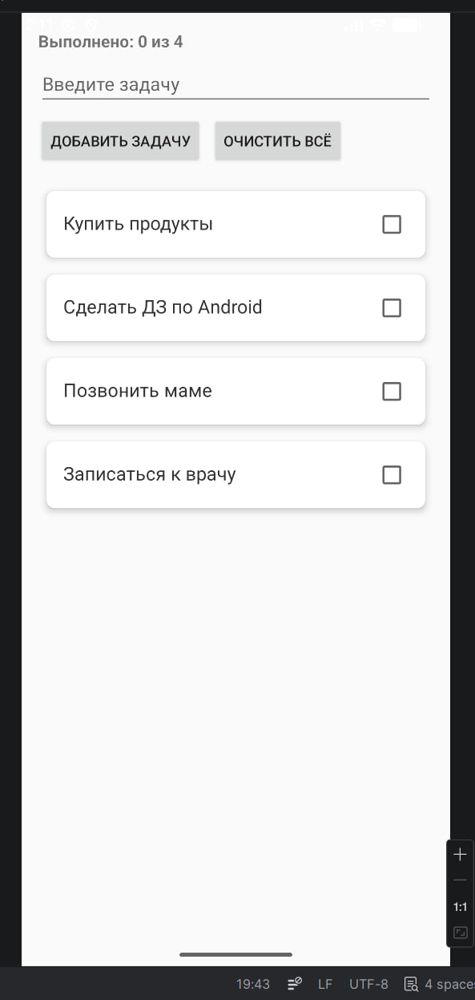
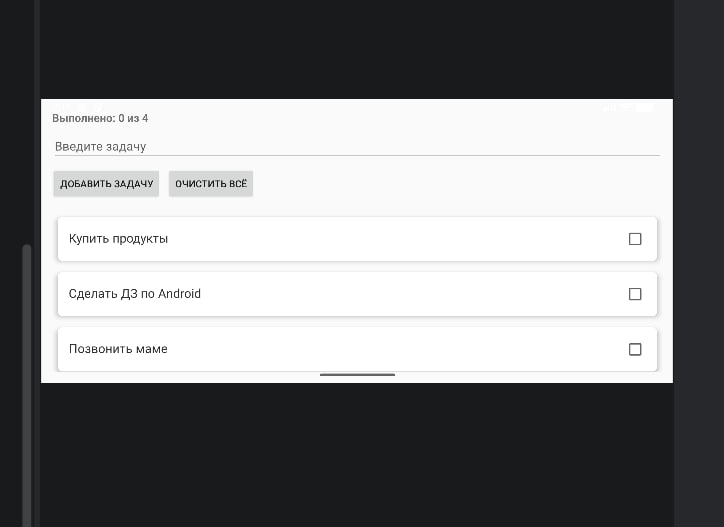
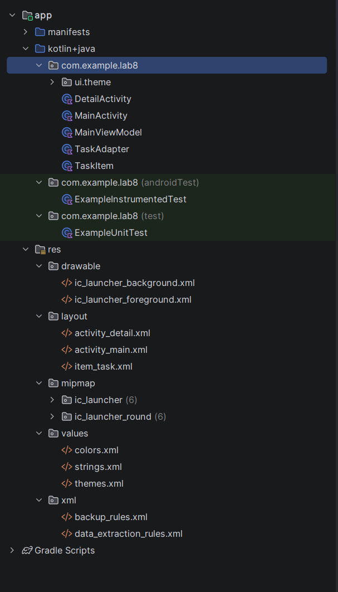

# Лабораторная работа №8

<div align="center">

**МИНИСТЕРСТВО НАУКИ И ВЫСШЕГО ОБРАЗОВАНИЯ РОССИЙСКОЙ ФЕДЕРАЦИИ**  
**ФЕДЕРАЛЬНОЕ ГОСУДАРСТВЕННОЕ БЮДЖЕТНОЕ ОБРАЗОВАТЕЛЬНОЕ УЧРЕЖДЕНИЕ ВЫСШЕГО ОБРАЗОВАНИЯ**  
**«САХАЛИНСКИЙ ГОСУДАРСТВЕННЫЙ УНИВЕРСИТЕТ»**

<br>
<br>

Институт естественных наук и техносферной безопасности  
Кафедра информатики  
**Каменев Александр Павлович**

<br>
<br>
<br>
<br>

Лабораторная работа №8  
**«Перенос логики списка задач из Activity в ViewModel. Использование StateFlow»**  
01.03.02 Прикладная математика и информатика  
3 курс

<br>
<br>
<br>
<br>
<br>
<br>
<br>
<br>
<br>
<br>
<br>
<br>
<br>

<div align="right">
Научный руководитель<br>
Соболев Евгений Игоревич
</div>

<br>
<br>
<br>

г. Южно-Сахалинск  
2026 г.

</div>

---

## Цель работы

Вынести логику и состояние списка задач из `Activity` в `ViewModel`, использовать `StateFlow` для обновления UI и сохранить данные при повороте экрана.

## Индивидуальное задание №2 — SharedFlow для уведомлений

В `MainViewModel` добавлен `SharedFlow` с id строковых ресурсов. `Activity` подписывается и показывает **Toast** («Задача добавлена», «Удалена», «Список очищен» и т.д.) — без прямых Toast в логике ViewModel.

Также сохранены: `RecyclerView`, `DetailActivity`, редактирование через `ActivityResultLauncher`.

Проект: **lab8**, пакет `com.example.lab8`.

## Скриншоты

  
*Рисунок 1 — Тестовые задачи после запуска*

<br>

  
*Рисунок 2 — Список сохранился после поворота (ViewModel)*

<br>

  
*Рисунок 3 — Структура проекта*

## Листинги

### 1. `MainViewModel.kt`

```kotlin
class MainViewModel : ViewModel() {

    private val _tasks = MutableStateFlow<List<TaskItem>>(emptyList())
    val tasks: StateFlow<List<TaskItem>> = _tasks.asStateFlow()

    private val _events = MutableSharedFlow<Int>(extraBufferCapacity = 1)
    val events: SharedFlow<Int> = _events.asSharedFlow()

    fun addTask(task: String) {
        if (task.isBlank()) {
            emitEvent(R.string.toast_empty_task)
            return
        }
        _tasks.value = _tasks.value + TaskItem(task.trim())
        emitEvent(R.string.toast_task_added)
    }

    fun deleteTask(index: Int) { ... }
    fun updateTask(index: Int, newText: String) { ... }
    fun toggleTaskDone(index: Int, isDone: Boolean) { ... }
    fun clearAll() { ... }
    fun loadTestData() { ... }
}
```

### 2. `MainActivity.kt` (подписка)

```kotlin
private val viewModel: MainViewModel by viewModels()

lifecycleScope.launch {
    repeatOnLifecycle(Lifecycle.State.STARTED) {
        viewModel.tasks.collect { tasks ->
            adapter.updateData(tasks)
            updateCompletedCount(tasks)
        }
    }
}

lifecycleScope.launch {
    repeatOnLifecycle(Lifecycle.State.STARTED) {
        viewModel.events.collect { messageRes ->
            Toast.makeText(this@MainActivity, messageRes, Toast.LENGTH_SHORT).show()
        }
    }
}
```

### 3. `TaskAdapter.kt`

```kotlin
fun updateData(newTasks: List<TaskItem>) {
    tasks = newTasks
    notifyDataSetChanged()
}
```

## Ответы на контрольные вопросы

**1. Для чего нужен ViewModel? Как он помогает при повороте?**

Хранит данные для экрана отдельно от Activity. При повороте Activity пересоздаётся, а ViewModel остаётся — список не пропадает.

**2. Чем StateFlow отличается от LiveData?**

StateFlow из Kotlin Coroutines, всегда есть текущее значение (`value`). Удобен с корутинами и чистым Kotlin-кодом.

**3. Что такое lifecycleScope и repeatOnLifecycle?**

`lifecycleScope` — корутины привязаны к жизненному циклу Activity. `repeatOnLifecycle(STARTED)` — collect только когда экран виден, без утечек.

**4. Как обновить данные в StateFlow?**

Присвоить новое значение: `_tasks.value = newList` (для `MutableStateFlow`).

**5. Преимущества ViewModel для тестирования?**

Логику можно тестировать без Android UI — только ViewModel и потоки данных.

## Вывод

Логику списка перенёс в `MainViewModel` с `StateFlow`. Activity только подписывается и обновляет адаптер. Для ИЗ №2 сделал `SharedFlow` для Toast-сообщений. После поворота экрана задачи остаются. Цель работы выполнена.

