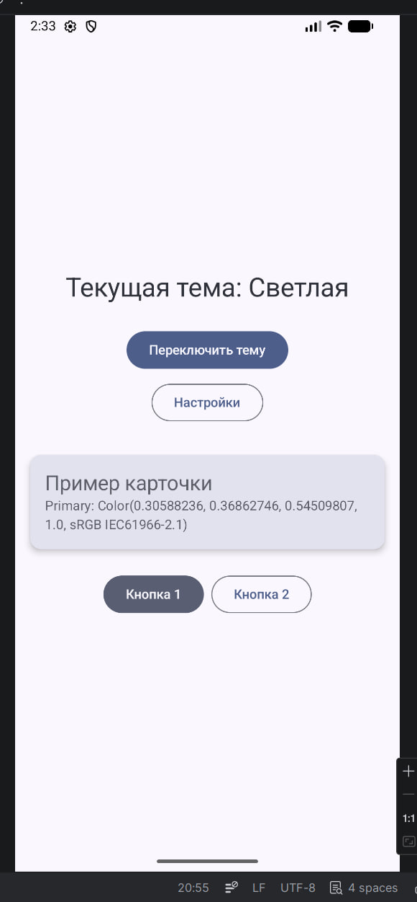
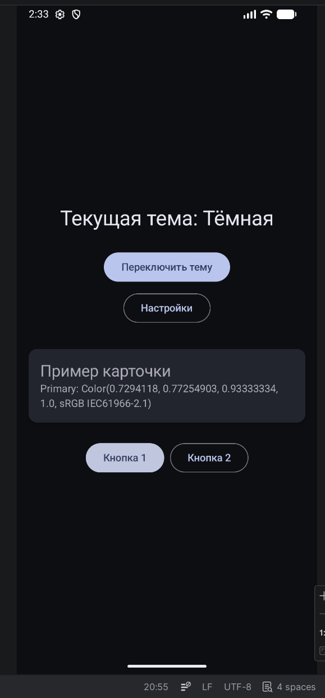
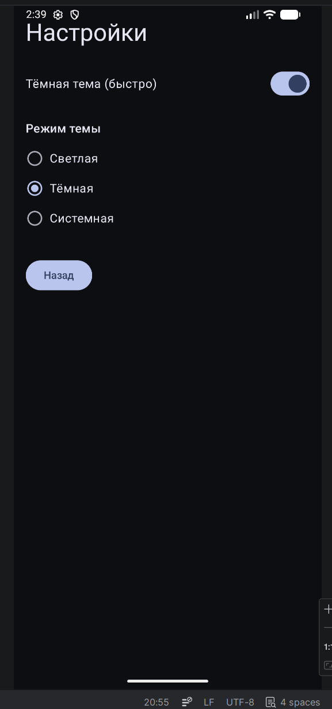

# Лабораторная работа №9

<div align="center">

**МИНИСТЕРСТВО НАУКИ И ВЫСШЕГО ОБРАЗОВАНИЯ РОССИЙСКОЙ ФЕДЕРАЦИИ**  
**ФЕДЕРАЛЬНОЕ ГОСУДАРСТВЕННОЕ БЮДЖЕТНОЕ ОБРАЗОВАТЕЛЬНОЕ УЧРЕЖДЕНИЕ ВЫСШЕГО ОБРАЗОВАНИЯ**  
**«САХАЛИНСКИЙ ГОСУДАРСТВЕННЫЙ УНИВЕРСИТЕТ»**

<br>
<br>

Институт естественных наук и техносферной безопасности  
Кафедра информатики  
**Каменев Александр Павлович**

<br>
<br>
<br>
<br>

Лабораторная работа №9  
**«Сохранение настроек темы. Тёмная/светлая тема в Compose»**  
01.03.02 Прикладная математика и информатика  
3 курс

<br>
<br>
<br>
<br>
<br>
<br>
<br>
<br>
<br>
<br>
<br>
<br>
<br>

<div align="right">
Научный руководитель<br>
Соболев Евгений Игоревич
</div>

<br>
<br>
<br>

г. Южно-Сахалинск  
2026 г.

</div>

---

## Цель работы

Изучить смену и сохранение темы в Jetpack Compose, использовать DataStore для настроек, реализовать светлую и тёмную тему.

## Индивидуальное задание №1 — три темы

Добавлены режимы: **Светлая**, **Тёмная**, **Системная** (как на устройстве). Выбор через `RadioButton` на экране настроек, значение сохраняется в DataStore.

Базовая часть: `ThemeSwitcherTheme`, кнопка «Переключить тему», динамические цвета на Android 12+.

Проект: **lab9**, пакет `com.example.lab9`.

## Скриншоты

  
*Рисунок 1 — Светлая тема*

<br>

  
*Рисунок 2 — Тёмная тема*

<br>

  
*Рисунок 3 — Экран настроек с выбором режима*

## Листинги

### 1. `SettingsManager.kt`

```kotlin
val themeMode: Flow<ThemeMode> = context.dataStore.data.map { preferences ->
    when (preferences[THEME_MODE_KEY]) {
        "light" -> ThemeMode.LIGHT
        "dark" -> ThemeMode.DARK
        else -> ThemeMode.SYSTEM
    }
}

suspend fun saveThemeMode(mode: ThemeMode) { ... }
```

### 2. `Theme.kt` — `ThemeSwitcherTheme`

```kotlin
val themeMode by viewModel.themeMode.collectAsState()
val isDarkTheme = when (themeMode) {
    ThemeMode.LIGHT -> false
    ThemeMode.DARK -> true
    ThemeMode.SYSTEM -> isSystemInDarkTheme()
}
val colorScheme = when {
    Build.VERSION.SDK_INT >= Build.VERSION_CODES.S ->
        if (isDarkTheme) dynamicDarkColorScheme(context) else dynamicLightColorScheme(context)
    isDarkTheme -> DarkColors
    else -> LightColors
}
MaterialTheme(colorScheme = colorScheme, content = content)
```

### 3. `ThemeViewModel.kt` / `MainActivity.kt`

ViewModel читает тему из DataStore, `toggleTheme()` и `setThemeMode()`. В `MainActivity` — `ThemeViewModelFactory(settingsManager)` и обёртка `ThemeSwitcherTheme`.

## Ответы на контрольные вопросы

**1. Как определить активную тему в Compose?**

`isSystemInDarkTheme()` — для системы. У нас ещё свой выбор из DataStore через ViewModel.

**2. Что такое `MaterialTheme.colorScheme`?**

Набор цветов UI: primary, background, surface, onPrimary и др. — всё приложение берёт отсюда.

**3. Как сохранить выбор между запусками?**

DataStore (или SharedPreferences): записать при смене, читать Flow при старте.

**4. Разница `isSystemInDarkTheme()` и пользовательского выбора?**

Первое — только настройки телефона. Второе — то, что пользователь выбрал в приложении (у нас может быть «Системная» = следовать за телефоном).

**5. Динамические цвета?**

На Android 12+ (`S`) цвета из обоев: `dynamicLightColorScheme` / `dynamicDarkColorScheme`.

## Вывод

Сделал переключение темы в Compose с сохранением в DataStore. Три режима (ИЗ №1), экран настроек со Switch и RadioButton. После перезапуска тема не сбрасывается. Понял, как связаны ViewModel, Flow и MaterialTheme.

## Автор

**Каменев Александр Павлович**  
Группа №331  
СахГУ, 2026
